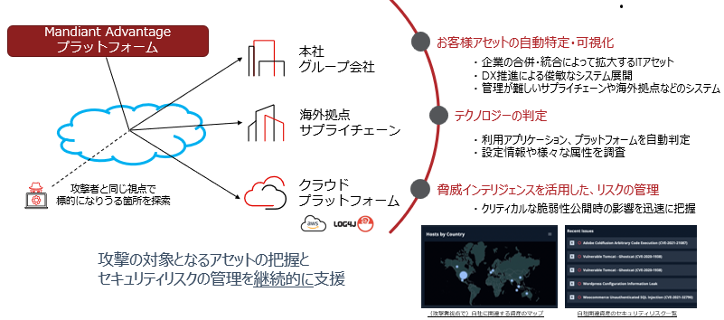

---
hide:
  - navigation
---

---

# Attack Surface Management セミナー

このセミナーでは、アタックサーフェス管理が必要とされる背景の解説と、Google Cloud が提供する Mandiant Attack Surface Management (ASM) を用いたハンズオンを実施します。ASM を実際に操作し、参加者の組織に関連するアタックサーフェスを確認することで、ASM の活用方法を体験いただきます。

---

## アタックサーフェス管理とは？

脅威インテリジェンスを活用したセキュリティ対策として、攻撃対象領域（アタックサーフェス）の管理が注目されています。自組織に関係するIT資産を「攻撃者の視点で」把握し、セキュリティリスクの評価を行うことで下記のセキュリティ課題を対処することができます。

- 企業のグローバル化にともなう、グループ会社・海外拠点・サプライチェーンの IT 資産の把握とセキュリティ評価

- 事業部門の DX 推進による、クラウド環境やアジャイル開発環境の把握とセキュリティ状態の可視化

- クリティカルな脆弱性が公開された際の、自組織の影響範囲の特定と対策

- リモートワーク推進にともなう、VPN などのアクセスポイントのセキュリティ状態の確認

---

## 開催概要

- 参加費: 無料

- 会場: オンライン開催(Google Meet)、定員: 15名/回

- 対象: Google Cloud Security、Mandiant のソリューションにご興味があるセキュリティ担当者様（同業他社、競合他社の方はお断りしております。予めご了承ください)

---

## 開催スケジュール

今後の予定（登録締切りは開催日の2日前です）

- 2024年４月18日(木) 15:00 - 16:30　申込終了しました

過去開催分

- 2023年11月30日(木) 13:00 - 14:30　終了
- 2023年９月15日(金) 13:00 - 14:30　終了
- 2023年10月13日(金) 15:00 - 16:30　終了
- 2023年８月10日(木) 13:00 - 14:30　終了
- 2023年７月26日(水) 16:00 - 17:30　終了
- 2023年７月13日(木) 13:00 - 14:30　終了
- 2023年６月14日(木) 15:00 - 16:30　終了
- 2023年４月14日(金) 13:00 - 14:30　終了
- 2023年３月16日(木) 15:00 - 16:30　終了
- 2023年２月22日(水) 13:00- 14:30　終了

---

## 注意事項

- 各回のセミナー内容は同一です
- 登録の締切りは開催日の2日前です
- 同業他社、競合他社のご参加はお断りしております
- 勤務先メールアドレスでご登録ください（個人のフリーメール、グループアドレスでの登録はできません）
- <u>Mandiant Advantage のアカウントの事前作成が必要となります。当日までにアカウントを作成ください</u>  [アカウント作成ガイド](https://seminar.mndt.work/ASM_Seminar_AccountGuide_202404.pdf)
- ハンズオン中に自社組織のアタックサーフェースの探索結果を確認いただくため、ご登録いただいたメールアドレスのドメインに対して事前に探索を行います。インターネット検索サイトのクローリングに似た無害な通信ですが、自社セキュリティ製品(WAF/IDSなど) にログが記録されることがございます。セミナー登録にあたり予めご了承ください

---
